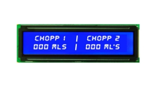


### **DESIGN - CDIO: Automatizador de Chopp**
###
### **Introdução:**
### O Automatizador de Chopp representa uma solução inovadora para o mercado de bares e pubs, visando otimizar a experiência dos clientes e a eficiência operacional dos estabelecimentos. Este design conceitual aborda os principais aspectos físicos, eletrônicos e de interface do usuário para garantir a eficácia e a atratividade do produto.
###
Diagramas de Blocos:

Figura 01 - Diagrama de Blocos

Sistema Eletrônico:

` `

`			`Figura 2-  Fluxograma de Operação.

`	`Conforme o fluxograma acima, o start do sistema é dado quando o cliente coloca a caneca de Chopp e pressiona o botão para iniciar. Após apertar o botão da torneira desejada, a placa recebe o comando e libera a saída programada para acionar o relé, que por sua vez irá liberar o solenóide de fluxo unilateral que irá liberar a passagem do chopp. Em sequência, o CHOPP passa pelo contador de fluxo que a cada giro das pás gera um pulso que está em referência de um ímã, enviando um sinal PWM, que por sua vez será lido pela placa e apresentado no display a quantidade de ML em tempo real. Por fim, basta degustar do CHOPP selecionado!

###
### Interface do Usuário:

1\. Tela de Exibição:

- Localizada na parte frontal do equipamento, uma tela LCD ou LED exibirá informações como a quantidade de mililitros sendo servida e a torneira selecionada.

2\. LEDs de Indicação:

- Dois LEDs (um vermelho e outro verde) para cada torneira estarão posicionados acima da tela para indicar o status do fluxo de cerveja: vermelho para fechado e verde para aberto.

3\. Botões de Controle:

- Dois botões de controle estarão dispostos abaixo dos LED’s para permitir que o usuário selecione a torneira desejada e habilite o fluxo de cerveja.

4\. Local para extração do Chopp:

- As torneiras automatizadas estarão dispostas na parte superior do equipamento, posicionadas de forma que o fluxo de cerveja seja direcionado para a caneca de maneira controlada.

5\. Design de Interface de Usuário:

- A tela exibirá claramente as opções de torneiras e a quantidade de mililitros a ser servida em cada torneira.
- O layout será intuitivo e fácil de entender, permitindo uma navegação suave para o usuário.

6\. Design Estético:

- Cores atraentes e apropriadas para o ambiente de bar, como o preto do Gabinete e iluminação de LED para dar um visual atraente e sofisticado ao equipamento.

Segue figura 3 exemplificando a interface ao usuário:

Figura 3: LCD Display interface do usuário.

Segue figura 4 exemplificando o produto final pela visão do usuário:

Figura 4: Parede de autosserviço com automatizador MHL Solucoes.

### **Conclusão:**

O design do Automatizador de Chopp busca unir a funcionalidade técnica com uma estética atraente, oferecendo um produto que atenda às necessidades dos clientes e dos estabelecimentos comerciais. Com uma abordagem centrada no usuário e aprimoramentos contínuos baseados em feedbacks, buscamos oferecer uma solução de alta qualidade que revolucione o cenário dos bares e pubs, tornando a experiência de servir e desfrutar de um chopp mais eficiente e prazeroso.

