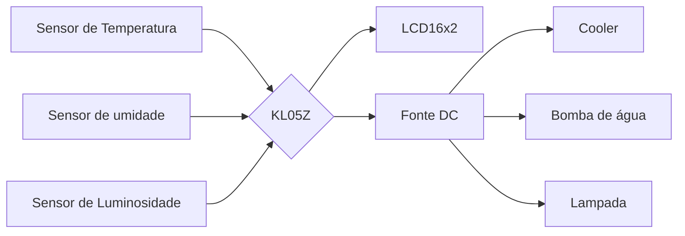

# MCC1_IFSC_2023_02

# Estufa Automatizada

  

Em um cenário onde a conexão com a natureza e a busca por uma vida mais saudável se tornaram prioridades para muitos, as estufas residenciais estão ganhando popularidade.

  

Com o crescente aumento da população, espaços e a produção de alimentos, sempre foram fatores de discussão na sociedade, Thomas Malthus elaborou a teoria de com a crescente dessa população em ritmo acelerado iria superar a oferta de alimentos e que isso traria problemas como fome e miséria no futuro, mas o que Malthus não levava e consideração era como seria o avanço tecnológico. Atender a demanda de mercado sobre produtos alimentícios sempre foi o foco das industrias.

  

Esta estufa residencial é projetada com um toque tecnológico. Ela é equipada com sensores de umidade, temperatura e luminosidade que permitem um controle preciso do ambiente interno

  

Os sensores desempenham um papel crucial nesta estufa residencial, garantindo que as plantas recebam a quantidade certa de água e luz. Se a umidade cair abaixo do nível desejado, os sistemas de irrigação automática são ativados para manter o solo úmido. Se a temperatura subir demais em um dia quente de verão, as ventoinhas são ligadas para que possam refrigerar o ambiente. E quando a luz do sol diminui, as luzes internas são ligadas automaticamente para manter o crescimento das plantas.

  

A proposta de ação deste projeto de estufa residencial envolve a criação de um sistema de controle ambiental altamente sofisticado, que utiliza sensores e atuadores para otimizar as condições de crescimento das plantas de forma precisa e eficiente. Isso será alcançado por meio da implementação de tecnologias modernas e sustentáveis, com base em uma fundamentação teórica sólida.

  

O projeto se baseia em conceitos teóricos fundamentais relacionados à horticultura e ao cultivo de plantas, bem como à automação e controle de sistemas. Os sensores de umidade, temperatura e luminosidade são fundamentados em princípios científicos que permitem a monitorização precisa das condições ambientais. Por exemplo, a teoria por trás da relação entre a umidade do solo e o crescimento das plantas é bem estabelecida na agricultura.

  

A proposta de ação também considera a influência das condições ambientais nas plantas, destacando a importância de manter os parâmetros ideais para maximizar a produção e a qualidade dos cultivos. Isso está alinhado com a teoria de que a temperatura, a umidade e a luminosidade desempenham papéis críticos no desenvolvimento das plantas, influenciando seu metabolismo e seu ciclo de vida.

  

O projeto da estufa residencial combina tecnologia avançada e materiais acessíveis para criar um ambiente de cultivo ideal para plantas, controlado por um microcontrolador KL05Z. A visão principal é fornecer um sistema de cultivo automatizado e sustentável que seja eficiente em termos energéticos, amigável para os usuários e forneça feedback visual em tempo real.

  

**Trabalho a ser desenvolvido:**

  

1.  **Design da Estufa:**

- A estrutura da estufa será construída com materiais de alta qualidade e baixo custo, como uma estrutura de PVC e painéis de plástico transparente para maximizar a entrada de luz solar.

- A ventilação será fornecida por uma ventoinha acoplada a uma placa de Peltier para refrigeração, permitindo o controle preciso da temperatura interna.

2.  **Sensores para Microcontrolador KL05Z:**

- Sensores de umidade do solo serão usados para monitorar a umidade do solo em várias áreas da estufa.

- Sensores de temperatura serão implementados para acompanhar as variações de temperatura.

- Sensores de luminosidade detectarão os níveis de luz natural na estufa.

3.  **Controle de Luminosidade e Aquecimento:**

- Para controle de luminosidade, será utilizada uma lâmpada de filamento de 12V. O microcontrolador KL05Z ajustará a intensidade da luz artificial com base nas leituras dos sensores de luminosidade, economizando energia e proporcionando um ambiente ideal para o crescimento das plantas.

- Se necessário, o sistema incluirá um elemento de aquecimento controlado pelo KL05Z para manter a temperatura interna em níveis adequados durante períodos mais frios.

4.  **Irrigação:**

- Um sistema de irrigação será integrado, com uma bomba d'água controlada pelo microcontrolador. Os sensores de umidade do solo determinarão quando a irrigação é necessária, garantindo que as plantas recebam a quantidade certa de água.

5.  **Display LCD:**

- Um display LCD será incorporado ao sistema para mostrar os valores das medidas dos sensores em tempo real.

- O display também permitirá que os usuários visualizem e ajustem os parâmetros pré-definidos, como níveis de umidade, temperatura e luminosidade, oferecendo uma interface amigável e interativa.

**Estratégias e Técnicas:**

  

- Será implementado um algoritmo de controle que ajusta automaticamente os parâmetros com base nas leituras dos sensores e nas configurações pré-definidas pelos usuários.

- As técnicas de controle PID serão usadas para manter a estabilidade do ambiente da estufa, garantindo que as condições ideais sejam mantidas.

  

**Tecnologias Utilizadas:**

  

- Microcontrolador KL05Z para processamento e controle.

- Sensores de umidade do solo, temperatura e luminosidade compatíveis com o KL05Z.

- Ventoinha com placa de Peltier para controle de temperatura.

- Estrutura de PVC e plástico transparente para a estufa.

- Lâmpada de filamento de 12V para controle de luminosidade.

- Bomba d'água para irrigação controlada.

- Display LCD para feedback visual e interação com o usuário.

                    
